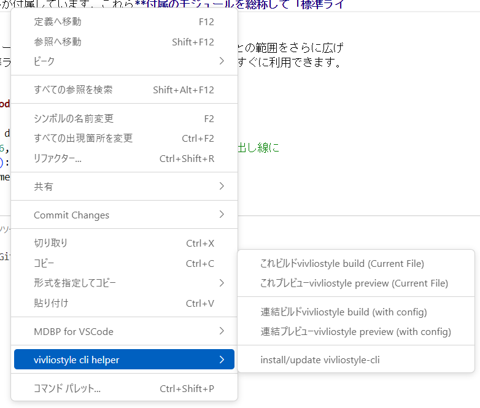

# vivliostyle-cli-helper README
Vivliostyle CLIのコマンド発行を代行する機能拡張です。

https://docs.vivliostyle.org/ja/vivliostyle-cli

事前に[Node.js](https://nodejs.org/ja/)をインストールし、ターミナルからvivliostyle CLIをインストールしてください。

```
npm install -g @vivliostyle/cli
```

※右クリックメニューからの実行も可能です。

## Features
コマンドパレットから4つのコマンドを選択できます。previewと名の付くものはVivliostyleプレビューを表示し、buildと名の付くものはPDFを生成します。


また、現在エディタで開いているファイル（HTMLまたはMakrdown）を対象にするものと、vivliostyle.confg.jsの設定を対象にするものがあります。vivliostyle.config.jsでは複数ファイルを連結できます。

#### vivliostyle.config.jsの例
```
// @ts-check
const vivliostyleConfig = {
  entry: [
    // 目次の生成テスト
    // { rel: 'contents', theme: '20_genkou/_css/main.css' },
    'formattest_chap1.html',
    // 'formattest_chap2.html'
  ], 
  // toc: 'toc.html',
  // tocTitle: '目次',
  output: [
    '30_pdf/merged_output.pdf',
  ],
};

module.exports = vivliostyleConfig;
```

### プレビュー
プレビューコマンドを実行すると、Webブラウザが起動してプレビューが表示されます。HTMLやCSSファイルの更新に伴ってプレビューも更新されます。


プレビューの表示中は、VSCodeのターミナルに「Up and running([ctrl+c] to quit)」と表示されています。ターミナルにカーソルがある状態でCtrl+Cキーを押すとプレビューを終了します。

プレビューが終了するまで他のコマンドは実行できません。

### 右クリックメニュー対応
MarkdownまたはHTMLファイルを右クリックして実行できるようにしました。




## Release Notes
### 0.0.10
macOSなどで「npm install -g @vivliostyle/cli」を実行したときにsudoを付けてくれる……かも


### 0.0.9
コマンド名に日本語追加

### 0.0.8
build current時に、出力PDF名をソースファイルに合わせる

メニュー名の誤字修正

### 0.0.7
右クリックメニュー対応

### 0.0.6
vivliosytle-cliのインストールコマンドをVSCodeから実行できるようにした

### 0.0.5
README更新

### 0.0.4
コマンド名を実際のvivliostyleのコマンドに似せた

### 0.0.3
- 既存のターミナルを使うのではなく、「vivliostyle-cli-helper」という名前のターミナルを作るようにする
- ファイル名をダブルクォートで囲む

### 0.0.2
Markdownファイルでプレビューが更新されない問題と、Macでエラーが出ることがある現象を解消

### 0.0.1

Initial release of ...

